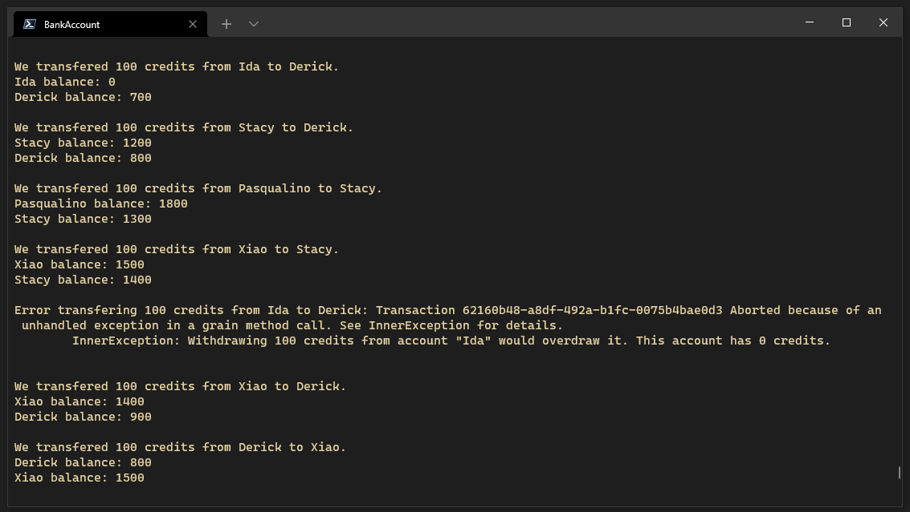

---
languages:
- csharp
products:
- dotnet
- dotnet-orleans
page_type: sample
name: "Orleans BankAccount ACID transactions"
urlFragment: "orleans-bank-account-acid-transactions"
description: "An example of a BankAccount using ACID transactions."
---

# Orleans Bank Account with ACID transactions

This sample demonstrates how to implement ACID transactions using Orleans using a bank account scenario.
There are two kinds of grains:



* `AccountGrain`, which implements `IAccountGrain`, simulates a bank account with a balance.
* `AtmGrain`, which implements `IAtmGrain`, simulates an Automatic Teller Machine that allows transfers between two bank accounts.

`AtmGrain` has this interface:

```csharp
public interface IAtmGrain : IGrainWithIntegerKey
{
    [Transaction(TransactionOption.Create)]
    Task Transfer(Guid fromAccount, Guid toAccount, uint amountToTransfer);
}
```

`AccountGrain` has this interface:

```csharp
public interface IAccountGrain : IGrainWithGuidKey
{
    [Transaction(TransactionOption.Join)]
    Task Withdraw(uint amount);

    [Transaction(TransactionOption.Join)]
    Task Deposit(uint amount);

    [Transaction(TransactionOption.CreateOrJoin)]
    Task<uint> GetBalance();
}
```

The `[Transaction(option)]` attributes on the grain methods tell the runtime that these methods are transactional.
The `IAtmGrain.Transfer` method creates a transaction, while the `IAccountGrain.Withdraw` and `IAccountGrain.Deposit` methods must be called in the context of existing transactions.

`AtmGrain.Transfer(...)` is implemented as follows:

```csharp
public async Task Transfer(
    IAccountGrain fromAccount,
    IAccountGrain toAccount,
    uint amountToTransfer)
{
    await Task.WhenAll(
        fromAccount.Withdraw(amountToTransfer),
        toAccount.Deposit(amountToTransfer));
}
```

The `Transfer` method withdraws the specified amount from one `IAccountGrain` and deposits it in the other. Orleans ensures that this occurs in the context of a transaction to ensure consistency.

The `AccountGrain.Deposit` method adds the deposited amount to the account balance using the `ITransactionalState<T>.PerformUpdate` method:

```csharp
public Task Deposit(uint amount) => _balance.PerformUpdate(x => x.Value += amount);
```

Real banks allow overdrawing accounts, but this sample does not. `AccountGrain.Withdraw(uint amount)` prevents overdrawing by throwing an exception, causing the transaction to be aborted:

```csharp
public Task Withdraw(uint amount) => _balance.PerformUpdate(x =>
{
    if (x.Value < amount)
    {
        throw new InvalidOperationException(
            $"Withdrawing {amount} credits from account \"{this.GetPrimaryKeyString()}\" would overdraw it."
            + $" This account has {x.Value} credits.");
    }

    x.Value -= amount;
});
```

## Sample prerequisites

This sample is written in C# and targets .NET 9.0. It requires the [.NET 9.0 SDK](https://dotnet.microsoft.com/download/dotnet/9.0) or later.

## Building the sample

To download and run the sample, follow these steps:

1. Download and unzip the sample.
2. In Visual Studio (2022 or later):
    1. On the menu bar, choose **File** > **Open** > **Project/Solution**.
    2. Navigate to the folder that holds the unzipped sample code, and open the C# project (.csproj) file.
    3. Choose the <kbd>F5</kbd> key to run with debugging, or <kbd>Ctrl</kbd>+<kbd>F5</kbd> keys to run the project without debugging.
3. From the command line:
   1. Navigate to the folder that holds the unzipped sample code.
   2. At the command line, type [`dotnet run`](https://docs.microsoft.com/dotnet/core/tools/dotnet-run).

First start the *BankServer* process

``` bash
dotnet run --project BankServer
```

Then start the *BankClient* process

``` bash
dotnet run --project BankClient
```

The client will issue transactions between random accounts in a loop, printing the results. For example:

```console
We transferred 100 credits from Pasqualino to Ida.
Pasqualino balance: 1500
Ida balance: 1600
```

When a withdraw would overdraw an account, the client will print an error like so:

```console
Error transferring 100 credits from Derick to Xaawo: Transaction 2edc92f5-a94d-4167-9522-fa661cc030ff Aborted because of an unhandled exception in a grain method call. See InnerException for details.
        InnerException: Withdrawing 100 credits from account "Derick" would overdraw it. This account has 0 credits.
```

## Configuring Azure Table Storage

Set the `AZURE_STORAGE_CONNECTION_STRING` environment variable before starting the `BankServer` process to enable Azure Table Storage for grain and transactional state. Tables named `OrleansGrainState` and `TransactionalState` will be created if they do not exist.

This repository includes a workflow, `.github/workflows/azure-resources.yml`, which provisions these tables. The workflow authenticates using GitHub's OpenID Connect (OIDC) integration, so configure the following secrets and run the workflow:

- `AZURE_CLIENT_ID` – application (client) ID used for OIDC login
- `AZURE_TENANT_ID` – Azure Active Directory tenant ID
- `AZURE_SUBSCRIPTION_ID` – subscription containing the resources
- `AZURE_RG` – resource group name
- `AZURE_LOCATION` – Azure region
- `AZURE_STORAGE_ACCOUNT` – storage account name

